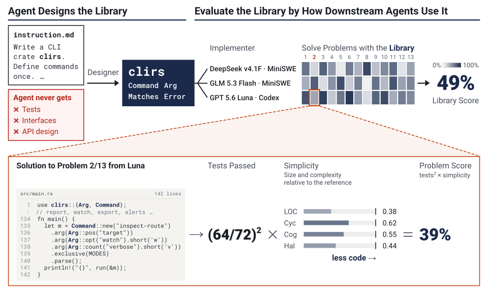

# LibraryDesignBench (LDB)

[](https://arxiv.org/abs/2609.36730)
[](https://ldbench.com)
[](LICENSE)

<p align="center">
  
</p>

---

**Can agents design libraries for agents?** LibraryDesignBench (LDB) scores a
library by how well other agents can build with it, across 242 expert-validated
problems in 15 tasks and four languages.

LDB operates in two phases:

1. **Design Phase**: an author agent builds a library in `/workspace` from the
   task's `design/instruction.md`.
2. **Evaluation Phase**: fresh implementor agents solve the task's problems
   under one library condition: the authored library (read-only at `/library`),
   no library (the floor), or a pinned production library (the comparator).

Each trial scores `pass_rate^2 x simplicity`, from 0 to 1. Simplicity is the mean
ratio of a reference solution's static metrics to the implementor's, each ratio
capped at 1.

## Setup

Requires Python 3.12+, `uv`, `git`, and a running Docker daemon.

```bash
uv sync              # add --extra dev for pytest, ruff, ty
uv run ldb --help
```

- Tasks come from [`ldb-tasks`](https://github.com/gabeorlanski/ldb-tasks),
  cloned at a pinned revision on first use.
- Trials run on [Harbor](https://github.com/harbor-framework/harbor) with
  Docker. Append `environment.type=modal` (or `daytona`) to run elsewhere;
  provider credentials are separate from agent credentials.
- Pass model API keys as `--agent-env "NAME=$NAME"` with `NAME` exported
  **before the first run**. Harbor then saves a `${NAME}` reference instead of
  a masked value, so keep it exported when resuming.

## Quick start

Author one library for the `clirs` task and evaluate one implementor on one
problem:

```bash
uv run ldb run configs/experiments/official.yaml \
  -a claude-code -m anthropic/claude-sonnet-5-5 --reasoning high \
  --task clirs --problem maintainer-tools --eval-agent luna \
  -n 1 design.attempts=1 evaluation.attempts=1
```

`-a`/`-m`/`--reasoning` pick the author agent; everything else comes from the
config, overridden by trailing `KEY=VALUE` pairs. `--task` limits which
libraries are authored; `--problem` and `--eval-agent` limit which evaluation
cells run. A design trial can still take hours. Results land in
`runs/agent_attempts/<experiment>/ldb-result.json`.

`--task` and the overrides are saved with the experiment; `--problem` and
`--eval-agent` apply to this invocation only, so the report stays incomplete
until the other cells run. Repeat them when continuing:

```bash
uv run ldb run runs/agent_attempts/<experiment> --problem maintainer-tools --eval-agent luna
```

## Full experiment

Drop the selectors to run the whole config: 15 tasks, three design attempts
each, three implementors across 242 problems. See
[docs/configuring-experiments.md](docs/configuring-experiments.md) to write
your own.

```bash
# Design and evaluate everything; output in runs/agent_attempts/run_<timestamp>/
uv run ldb run configs/experiments/official.yaml \
  -a claude-code -m anthropic/claude-sonnet-5-5 --reasoning high

# Stop after the Design Phase; resume later to evaluate
uv run ldb run configs/experiments/official.yaml \
  -a claude-code -m anthropic/claude-sonnet-5-5 --reasoning high --design-only

# Resume an experiment from its saved manifest
uv run ldb run runs/agent_attempts/<experiment>
```

Resuming reruns slots that need another agent execution, regrades or
remeasures saved ones, and evaluates newly finished libraries. A finished
solution that fails its tests is not retried.

## Evaluation only

`ldb eval` evaluates one implementor under one library condition and writes
`runs/evaluation_<timestamp>/`. Options shared by all three: `--attempts`,
`--prompt`, `--task`, `--problem` (`NAME` or `TASK/NAME`), `--name`, `-n`.

```bash
# Libraries authored by a finished Design Phase
uv run ldb eval design runs/agent_attempts/<experiment> \
  -a codex -m gpt-5.6-luna --reasoning high

# Each task's default production library (others: --existing-library NAME)
uv run ldb eval existing-library -a codex -m gpt-5.6-luna --reasoning high

# No library; the default prompt tells the agent to use one, so swap it
uv run ldb eval no-library -a codex -m gpt-5.6-luna --reasoning high \
  --prompt configs/prompts/no_library_inst.md
```

Resume a standalone evaluation run with `uv run ldb resume runs/<run>`.

## LibraryUseBench

LibraryUseBench measures only how well models use production libraries: the
Evaluation Phase on existing libraries, with the same harness, prompt, and
attempt count for every model. Swap `-m` per model:

```bash
uv run ldb eval existing-library \
  -a mini-swe-agent --agent-version 2.4.6 -m anthropic/claude-sonnet-5-5 --reasoning high \
  --prompt configs/prompts/minimal.md --attempts 3 \
  --agent-kwargs config_file=configs/mini_swe_template.yaml
```

## Other commands

None of these run an agent. Every command has `--help`.

| Command | Purpose |
|---|---|
| `ldb recalculate RUN --pricing-config configs/pricing.yaml` | Remeasure saved workspaces with the current verifiers, reprice cost, rewrite every report. |
| `ldb verify run RUN --update` | Rerun the full behavioral tests on saved workspaces and write the results back. |
| `ldb verify task TASK -o DIR` | Check a task's no-library and production-library reference solutions. |
| `ldb static DIR` | Remeasure the static references of every task under DIR. |

## Documentation

- [docs/results.md](docs/results.md): reading `ldb-result.json` (one row per
  trial), the run layout, and every metric
- [docs/configuring-experiments.md](docs/configuring-experiments.md): experiment YAML and overrides
- [docs/comparing-results.md](docs/comparing-results.md): compare authored, existing and no-library results
- [docs/tasks.md](docs/tasks.md): task structure
- [docs/contributing-problems.md](docs/contributing-problems.md): adding problems
  (PRs go to [`ldb-tasks`](https://github.com/gabeorlanski/ldb-tasks), not here)
- [docs/runner.md](docs/runner.md): how the runner works end to end
- [configs/prompts/](configs/prompts/): evaluation prompts (`library_use_inst.md` is the official one)

## Citation

```bibtex
@misc{orlanski2026agentsdesignlibrariesagents,
      title={Can Agents Design Libraries for Agents?},
      author={Gabriel Orlanski and Alex L. Zhang and Avi Trost and Vincent Sunn Chen and Frederic Sala and Aws Albarghouthi and Ludwig Schmidt},
      year={2026},
      eprint={2609.36730},
      archivePrefix={arXiv},
      primaryClass={cs.AI},
      url={https://arxiv.org/abs/2609.36730},
}
```
