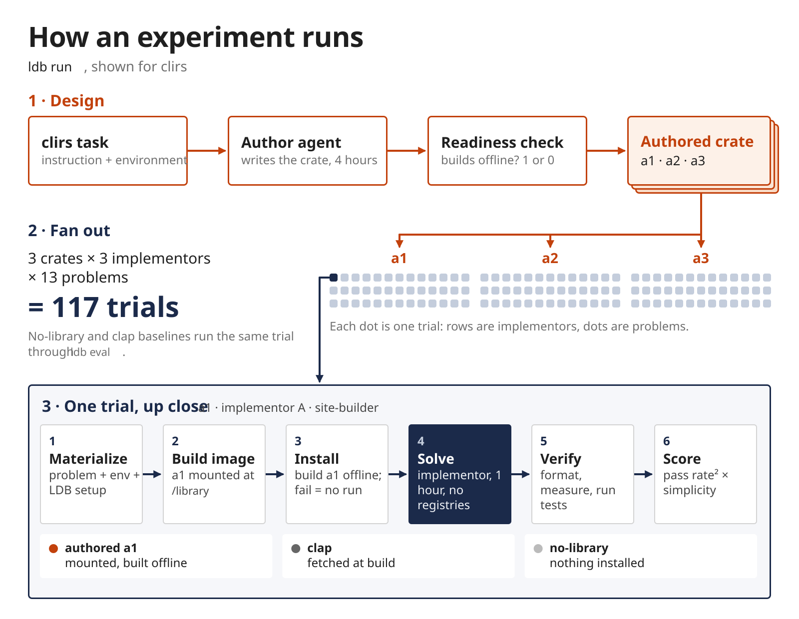

# How the runner works

What happens between `ldb run` / `ldb eval ...` / `ldb resume` and a finished `ldb-result.json`, so you can reason about results and failures. How to run is in [README.md](../README.md), vocabulary in [AGENTS.md](../AGENTS.md), files and metrics in [results.md](results.md), task layout and per-condition materialization in [tasks.md](tasks.md). This page covers the mechanism between them.

## 1. The big picture

<p align="center">
  
</p>

The figure follows one experiment (`ldb run`, `configs/experiments/official.yaml`) on clirs; the rest of this page is the mechanism behind each box.

```
config YAML + CLI flags                          cli/      parse flags, KEY=VALUE overrides, selectors
  -> ExperimentConfig (+ overrides)              models/   frozen schemas, config loading
  -> AuthorJob (design) / Job (evaluation)       models/   the request: tasks, arms, attempts, environment
  -> run dir: manifest.json, ldb-config.json,    runs/     layout, plan(), prompt rendering
     prompts/                                              (the manifest is now the authority)
  -> launches = slots in the `rerun` class       runs/     expand request into trial launches, classify slots
  -> build contexts, Harbor trial configs        harbor/   materialize.py copies task + condition
  -> trial batch (n concurrent, retries)         harbor/   runner.py, agents.py, environments.py
       agent phase (workspace setup, then agent) -> verifier (task's test.sh, in the sandbox)
  -> slot: result.json, trial-report.json        reports/  TrialPublisher moves each finished trial in
  -> reverify / remeasure replays                pipeline/ replay.py, only for slots in those classes
  -> rebuild_reports -> ldb-result.json          reports/  rebuilt from slots, published at the result owner
```

Module ownership: [cli](../src/lib_design_bench/cli/AGENTS.md), [models](../src/lib_design_bench/models/AGENTS.md), [runs](../src/lib_design_bench/runs/AGENTS.md), [harbor](../src/lib_design_bench/harbor/AGENTS.md), [pipeline](../src/lib_design_bench/pipeline/AGENTS.md), [reports](../src/lib_design_bench/reports/AGENTS.md), [metrics](../src/lib_design_bench/metrics/AGENTS.md) (cost and statistics only, at report time).

Two rules explain most behavior:
- **The manifest decides.** After a run directory exists, every later command replans from its `manifest.json`, never from the flags. Editing the manifest by hand is honored; changed task sources only log a warning (`tasks_hash`).
- **The slot decides what is owed.** A slot is written only when its trial ends, and its outcome class (section 5) says what is owed. Re-running a command launches only `rerun` slots; `reverify` and `reanalyze` slots go to replays; `finished` slots are untouched.

## 2. `ldb run`

**New experiment** (target is a config file). `--agent` and `--model` are required and describe the design agent; the implementors come from `evaluation.agents` in the config. `KEY=VALUE` overrides are applied to the raw YAML before validation, and the resolved config plus the override strings are stored in the manifest's `experiment` record. Empty `tasks` in the config means every task under the tasks root. `--task` on a config persists only those tasks. `-n` defaults to 4 and applies per phase. No `design.prompt` means the design agent gets the raw `design/instruction.md`.

**Order of work** (`_execute` in `cli/run.py`, under the Design Run's lease):
1. Design Run: `settle()` runs the launches, then `reverify()`, `remeasure()` and `finalize()`. It returns only when the whole design batch is done, so no evaluation trial starts before every design trial has finished.
2. `grow_evaluation_run()` creates or widens `evaluation_results/` to every cell: implementors x every task's problems x design attempts x `evaluation.attempts`, so `ldb-result.json` always lists all of them. Gating is per task: if any design attempt of a task is in the `rerun` class, every cell of that task is planned with its library unavailable (its cells mount all its attempts' libraries); other tasks proceed. Growing again once the task settles makes those cells runnable. An existing Evaluation Run keeps its persisted cells and only gains new ones; the current invocation's `environment` replaces its persisted one.
3. Evaluation Run: `settle()` again, under the Evaluation Run's own lease.

A cell whose library is unavailable, because its task has not settled or its design slot settled without a collected `/workspace`, is not launched (section 4). It reports score 0 with an `incomplete_reason` (see section 7) and stays `rerun` until the library exists.

`finally` always publishes the experiment result from whatever exists, including after Ctrl-C (in-flight trials are discarded, so their slots stay empty and become `rerun`). If a selected design slot is still `rerun` at the end, `ldb run` exits 1.

**Narrowing.** `--design-only` runs step 1, plans the cells of step 2 without running any, and writes a partial result listing them; continue the same directory without the flag. `--problem NAME` and `--eval-agent` (an `evaluation.agents` key) choose which unfinished Evaluation Phase cells this invocation runs; they do not reduce Design Phase authoring or change the persisted evaluation scope. Repeat them when continuing the experiment, or all remaining cells become eligible to run. A value that matches nothing in the experiment is rejected as a typo. `--task` narrows the persisted scope on a config and only this invocation's work on a directory.

**Existing experiment directory.** `ldb run EXPERIMENT_DIR` continues from the manifest: it settles the Design Run, grows the Evaluation Run so newly settled tasks' cells become runnable, then settles its cells. Flags that shape a new experiment (`--agent`, `--model`, `--reasoning`, `--agent-version`, `--agent-kwargs`, `--agent-env`, `--allow-agent-host`, `--output`, `--name`) are rejected; only `environment.*` overrides apply. `--hold-design-reruns` (directory only) does not relaunch design slots in `rerun`, so every other task proceeds; held slots still count as outstanding, so the command exits 1 after reporting them.

## 3. `ldb eval`

Each subcommand builds one `Job` (one implementor, label `<agent>__<model>`) and runs `execute()`: plan, run, finalize into a new run directory (`runs/evaluation_<timestamp>/` by default). Unlike `ldb run`, `eval` does not replay: a `reverify` or `reanalyze` slot stays as is until `ldb resume`.

| Subcommand | Library conditions | Notes |
|---|---|---|
| `design DESIGN_DIR` | one authored arm per design attempt (`a<N>`) of every selected task; an unsettled task's arms are planned unavailable | same `evaluation_job()` as `ldb run`; errors if no selected task has settled |
| `no-library` | `NoLibrary` | the floor |
| `existing-library` | each selected task's spine, or the `--existing-library` names | errors if a named library is not declared by the selected tasks |

`--cpus`, `--memory-mb`, `--storage-mb` size the sandbox; `environment.*` and `tasks_root` overrides are accepted; `--prompt` defaults to [configs/prompts/library_use_inst.md](../configs/prompts/library_use_inst.md). Other shared flags are in [README.md](../README.md).

**Prompt rendering** (`runs/plan.py`, at planning): the template is Jinja with `StrictUndefined` and a variable allowlist; any other variable is an error. `{{instruction}}` is passed through untouched and must survive, because Harbor fills it from the problem's `instruction.md`. The result is one file per task and arm in `prompts/`, and the agent receives its path as `prompt_template_path`.

## 4. Trial execution

- **Preparation** (`pipeline/run.py: run()`). If any launch that runs tests lacks its problem's `tests/static_reference.json`, the whole batch fails before any agent starts. Then: write Harbor's `config.json`, clear every launched slot (a rerun starts from an empty slot), skip Evaluation Phase cells whose authored library is unavailable (their slots stay empty), materialize one build context per `build_context_key`, and hand the trial configs to Harbor. A build context is keyed by task and library condition (design: task only), so all implementors and attempts over a cell share one directory; it is rebuilt from scratch on every invocation. `.harbor-*` staging is always deleted at the end; `build-contexts/` is deleted unless `--debug`. What each condition changes in the task is the table in [tasks.md](tasks.md#how-ldb-materializes-a-task).

- **Concurrency.** `-n` is Harbor's trial-queue width: that many trials, across all implementors and problems in the batch, run at once (a trial keeps its place while waiting to retry). `ldb run` applies it to the design and evaluation batches separately.

- **The agent wrapper** (`harbor/agents.py: WorkspaceSetupAgent`). Every agent, including the oracle and the replay agent, is wrapped: before it starts, the authored library is mounted at `/library` and the workspace is staged as described in [tasks.md](tasks.md#how-ldb-materializes-a-task). A failing authored-library setup exits 86 and raises `WorkspaceSetupError` before the agent runs. While the agent runs, a watchdog reads its `agent/codex.txt` log every 5 minutes and aborts a stalled provider connection with `AgentNetworkStalledError`, which is retryable. Other agents have no such log, so their stalls run to the timeout.

- **Environment.** `environment.type` (default `docker`; also `modal`, `daytona`, other Harbor types) is stored in the manifest request.
  - `ldb resume` persists `environment.*` overrides in the resumed run's manifest. `ldb run DIR` persists them only in the Evaluation Run's manifest; design launches use them for that invocation only.
  - Providers: Docker trials get an isolated Compose project; Modal trials use LDB's adapter, with `modal_vm_runtime` and a 6 hour `sandbox_timeout_secs` as defaults.
  - Sandbox size comes from the config's `design.sandbox` / `evaluation.sandbox` (or the `eval` size flags).
  - Network policy is Harbor's, per phase, from each task's `task.toml` (`network_mode` and `allowed_hosts` under `[agent]`, `[verifier]`, `[environment]`). `--allow-agent-host` adds hosts to the agent-phase allowlist only; Harbor ignores it, with a warning, when the effective policy is `public`.
  - Comparator leakage is blocked by a healthcheck at environment start for every condition except `existing`.
  - `--agent-env NAME=VALUE` goes to every agent's environment. Harbor persists a sensitive name only as a `${NAME}` template when the value equalled the host's variable at launch (otherwise redacted), and a non-sensitive name as-is. Export the same variables when you continue a run.

- **Limits.** LDB sets no agent timeout or budget of its own. The agent timeout is the task's `[agent] timeout_sec` and the verifier timeout its `[verifier] timeout_sec`; a spent provider usage limit surfaces as Harbor's `ApiUsageLimitError`. The agent timeout and the usage limit are recorded in the slot's `limit.json` (`timeout` | `cost` | `none`), and `agent-error.json` holds any exception the agent phase raised. An agent error does not skip verification: the verifier still grades whatever workspace was collected. A Claude Code run ending on `error_max_turns` or `error_max_budget` is treated as `finished` by `classify()`; it is not written to `limit.json`.

- **Retries** (`RETRY_CONFIG`). Up to 3 retries (4 executions) with 60s, 120s, 240s waits, only for infrastructure and provider errors (environment start timeout, Daytona errors, provider rate limit, overload, connection or 5xx errors, network stall). Earlier executions are archived under the slot's `retries/<n>/`. Any other exception is not retried; `classify()` (section 5) decides what it means, and a retryable one that exhausts its retries classifies as `rerun`.

- **Sandbox cost.** Hooks on environment start and end append each execution (retries included) to `sandbox-usage.json` in the slot and a copy in the run root's `sandbox-usage/<trial>.json`. Modal and Daytona intervals are priced by an estimate, and other remote providers are recorded unpriced. Docker writes no ledger and counts 0.0. The root copy survives slot clearing, so a rerun adds executions to the same ledger. The agent's `cost` is separate and comes from its reported usage or repricing in `metrics/`.

- **Publishing.** As each trial finishes, `TrialPublisher` moves its directory from `.harbor-*/` into the run as the slot and writes `result.json` and `trial-report.json`. A crash therefore loses only trials still in flight.

## 5. Durability and resume

**Lease.** `.resume.lock` is created exclusively with `pid`, `host` and start time and removed on exit. A leftover file after a crash is not detected as stale; `--force` deletes it, so use it only when no process is mutating the run. Resume leases the run and its evaluation child together.

**Classification** (`runs/outcomes.py: classify()`), first match wins:

| Evidence in the slot | Class |
|---|---|
| no valid `result.json` | `rerun` |
| a Harbor verification exception (`VERIFIER_EXCEPTIONS`) | `reverify`, or `rerun` if no workspace was collected |
| an exception that is not a limit (agent timeout or usage limit) | `rerun` |
| timeout with a stalled provider network, or with no model turn in `agent/trajectory.json` | `rerun` |
| no limit recorded, and the Claude Code log has no `result` event or a non-limit failure subtype | `rerun` |
| verifier graded 0 behavioral tests | `reverify`, or `rerun` if no workspace was collected |
| reward without a static measurement, no `format.log`/`measure.log`, workspace retained | `reanalyze` |
| everything else, including limit stops | `finished` |

Definitions are in [results.md](results.md#outcome-classes); `meta.outcome_counts` and `meta.complete` come from this function.

**What each class triggers** (`settle()`, the shared tail of `ldb run` and `ldb resume`): launch the `rerun` slots, then `reverify()`, then `remeasure()`, then `finalize()`.
- `rerun`: the slot is cleared and the trial launched again.
- `reverify`: replay with tests; no agent runs.
- `reanalyze`: replay with the behavioral tests skipped and the slot's recorded counts scored ([tasks.md](tasks.md#verifier-contract) lists the variables), so only measurement reruns.
- stale measurement: `remeasure()` also selects `finished` Evaluation Phase slots that kept their counts and workspace but whose reward lacks the current `MEASUREMENT_REVISION` (`pipeline/replay.py`) or whose `reference_identity` differs from the current `static_reference.json`. Bumping the revision, or refreshing a reference with `ldb static`, therefore makes the next `ldb run DIR` or `ldb resume` remeasure the affected slots. `classify()` does not look at this, so such slots still count as `finished` until remeasured. Design slots are never remeasured.

**Replays.** A replay is a throwaway run in a temp directory beside the source, reusing the source trial names. Its agent, `ReplayArtifactsAgent`, sets the staged starter aside, uploads the slot's `artifacts/`, restores the starter under it, and runs the task's `replay_install_cmd` (skipped for `no-library`); then the current `test.sh` grades it. `update_source` merges back only replays that produced a verifier result (for a `verify` replay, also a Harbor verification exception); others are logged and leave the source slot as it was. A `verify` merge replaces the slot's `verifier/` directory, `verifier_result` and exception, and records `manifest.verification`. A `remeasure` merge replaces only the measurement files and `verifier_result`, keeping the agent's own exception (such as its limit) and the recorded test logs. `ldb-result.json` is removed first and the manifest is written last as the completion marker; the trial report keeps the original `usage`. A replay that fails before it can grade (an `OSError` or `ValueError`) is logged, leaves every source slot untouched, and is retried by the next `ldb resume`.

**Resume scope.** `ldb resume RUN_DIR` settles the directory you give it. On an experiment root that means the Design Run; the Evaluation Run is grown to every cell (without launching any), remeasured (`reanalyze` and stale slots) and refinalized, and its `rerun` and `reverify` slots wait. To rerun evaluation cells use `ldb run EXPERIMENT_DIR` or `ldb resume EXPERIMENT_DIR/evaluation_results`. `environment.*` overrides replace the saved provider (keeping the sandbox size) in the given run's request and are persisted, so later resumes stay on it; on an experiment root the Evaluation Run's environment is not changed. Rerun and replay share one event loop; a remote environment breaks if a second loop touches its clients.

**Report rebuild** (`reports/rebuild.py`). Every derived document comes from one path: rebuild each `trial-report.json` from the slot's `result.json` (an empty slot becomes score 0 with the cell's `incomplete_reason`, else "missing Harbor result"), delete `ldb-result.json`, rewrite the run-root `result.json`, then publish `ldb-result.json` at the result owner. Costs are re-derived at the rates each trial was last priced at unless `ldb recalculate` gives new ones. For an experiment, finalizing either run republishes the pair. `ldb recalculate PATH` is the same rebuild after remeasuring every Evaluation Phase slot that kept counts and a workspace; on an experiment it first grows the Evaluation Run to every cell, so a result written before a task settled gains that task's cells.

## 6. Reference measurement

Both commands run Harbor's oracle agent (`oracle`, no LLM) through the same pipeline; the oracle executes the `solution/<condition>/solve.sh` that build-context materialization placed at `solution/`.
- `ldb static DIRECTORY`: finds every `task.yaml` below it and, for each active problem, measures the reference solution its `static_reference.json` names (or, for a new problem, the first existing library with a solution). It runs with the behavioral tests skipped, so only the task's own `static_measure.py` runs, then writes `tests/static_reference.json` from `verifier/static_metrics.json`. Measurements that succeeded are written even if others failed; the error names the failures and keeps the temp run (`ldb-static-references-*`).
- `ldb verify task TASK -o DIR`: an oracle `Job` with one attempt over the floor (`no-library`) and each existing library that has a checked-in solution for a problem, running the full verifier. It prints a JSON summary of reward, pass rate and static metrics per arm. It needs each problem's `static_reference.json` to exist.
- `ldb verify run SOURCE` is the manual form of a replay (section 5): it writes a persistent run into `<source>/verify`, or merges into the source with `--update`.

## 7. Failure modes

| Symptom | Likely cause | Look at |
|---|---|---|
| "Run resume lease already exists" | another process is running, or a crash left the lock | `.resume.lock` (pid, host); `--force` only if idle |
| batch fails before any agent: "Missing static reference" | problem has no `tests/static_reference.json` | run `ldb static`; `run.log` |
| "Skipping Evaluation Phase cell with unavailable Design Phase library"; trials with `incomplete_reason` | design slot has no result or collected workspace | `run.log`, design slot's `result.json`, `artifacts/manifest.json`; rerun the design slot |
| `ldb run` exits 1 "Design attempts produced no usable result" | selected design slots still `rerun` | `run.log` (lists slots and reasons); `ldb run DIR` |
| "Task sources changed since this run was planned" | `ldb-tasks` moved since planning; old and new slots graded by different tests | `manifest.json` `tasks_hash`; consider `ldb verify run --update` or `ldb recalculate` |
| trial `rerun` with `WorkspaceSetupError` / exit 86 | authored library's setup failed in the sandbox | slot `agent-error.json`, `trial.log` |
| environment fails to start, "comparator leakage" | the healthcheck found a comparator library in the image | `trial.log`, `result.json` `exception_info` |
| `reverify` slot | verifier timed out, could not read a reward, or graded 0 tests | `verifier/test-stdout.txt`, `result.json` `exception_info` |
| `reanalyze` slot | static measurement was never attempted | `ldb resume` remeasures it |
| "verifier measurement unavailable" | measurement was attempted and failed; the slot stays `finished` | `verifier/format.log`, `verifier/measure.log` |
| "Replay failed before any source slot changed" / "Discarded a verifier replay that graded nothing" | replay infrastructure failed; source slot untouched | `run.log`; rerun `ldb resume` |
| `rerun` after a timeout | agent never took a turn, or its provider network was down | `agent/trajectory.json`, `agent/codex.txt` ("waiting for network") |
| `rerun` on a Claude Code trial that exited cleanly | usage limit, auth or internal error in the stream | `agent/claude-code.txt` final `result` event |
| every trial fails on resume with loop or client errors (remote environment) | rerun and replay split across event loops | resume help text; use one `ldb resume` invocation |
| provider auth errors only after resume | `--agent-env` secrets were persisted as `${NAME}` templates or redacted | export the variables in the resuming shell (section 4) |
