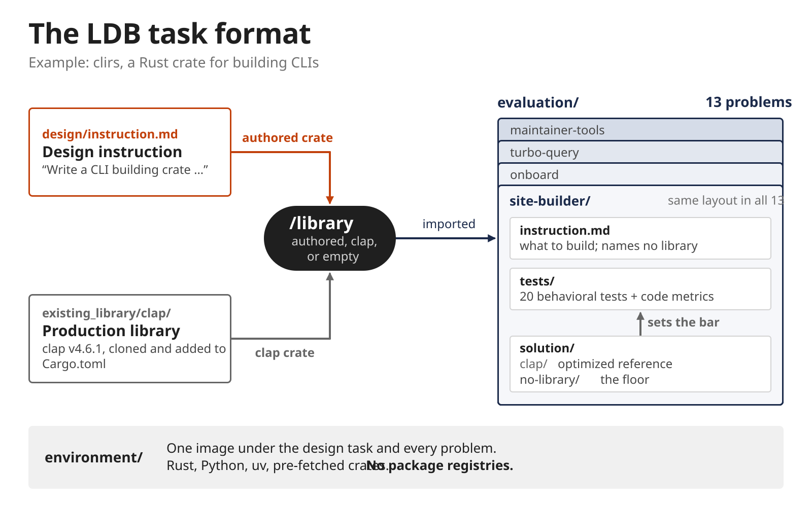
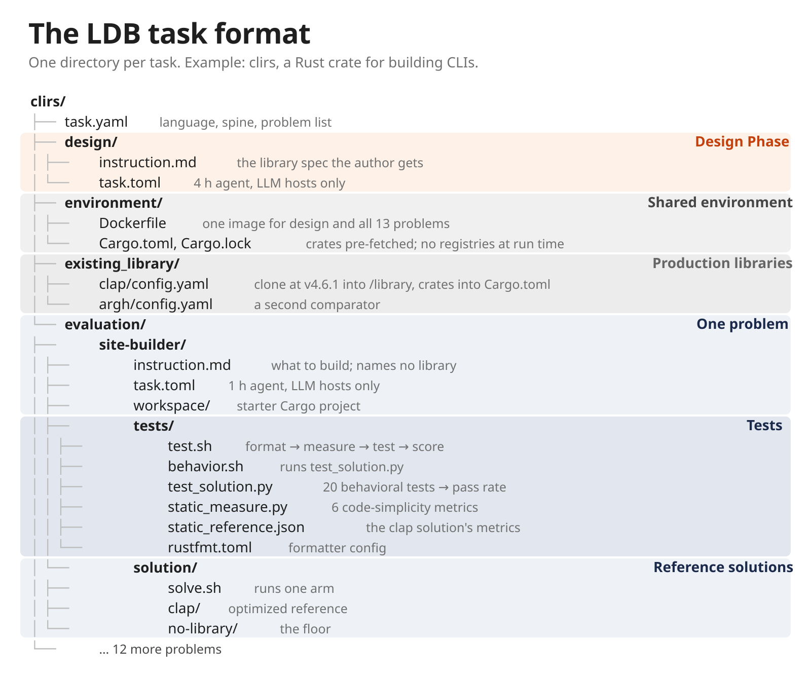

# Task structure

A task is a directory containing `task.yaml`. Tasks are not in this repo:

- Real tasks live in the `ldb-tasks` repo (`../ldb-tasks`). LDB fetches a pinned commit into `~/.cache/lib-design-bench/tasks` on first use. Pin: `_TASKS_REVISION` in `src/lib_design_bench/common.py`.
- Use another checkout with the `tasks_root=PATH` override or the `tasks_root` config key.
- In-repo fakes for tests: `tests/fixtures/tasks/{pyt,rsj}` (Python, Rust). Same layout as real tasks.

To add or change a problem, follow [Contributing problems](contributing-problems.md)
and open the PR in `ldb-tasks`. This repo contains the instructions; the task
checkout contains the task files.

<p align="center">
  
</p>

## Layout

A real task, clirs, file by file:

<p align="center">
  
</p>

Every field, using the fixture `tests/fixtures/tasks/pyt`:

```
task.yaml                      library_name, language, spine, existing_libraries,
                               existing_library_problems, problems, replay_install_cmd
design/                        Design Phase Harbor task
  instruction.md               the author prompt
  task.toml                    Harbor config; /workspace is the collected artifact
  solution/, README.md         fixtures only: a sample authored library
environment/                   image shared by both phases (Dockerfile + pinned deps)
existing_library/<lib>/
  config.yaml                  how to install one comparator (source/clone/ref, ...)
  setup.sh                     optional; appended to the library setup
evaluation/<problem>/          one Harbor task per problem
  instruction.md, task.toml
  workspace/                   starter files copied to /workspace (optional setup.sh)
  solution/<condition>/        reference solution per library condition, with solve.sh
  tests/                       verifier (see below)
```

Problem directory names are free-form (`01_step` in fixtures, kebab-case in real tasks). LDB has no notion of ordered steps. A problem is active only if listed in `problems`.

## Design vs evaluation

- **Design Phase**: one Harbor task, `design/`. An author agent writes a library in `/workspace`. That workspace is collected and is what the Evaluation Phase later mounts as the authored library.
- **Evaluation Phase**: one Harbor task per problem. A fresh implementor agent solves the problem under a library condition.
- Container paths: `/library` (installed or mounted library) and `/workspace` (agent working directory).

## References and libraries

- **existing library** (comparator): a real library declared in `task.yaml` with `existing_library/<lib>/config.yaml`.
- **spine**: the default existing library. Required when any are declared. `ldb eval existing-library` uses it unless `--existing-library` is given.
- **existing_library_problems**: optional map of library to problems. If present, every problem must be assigned to exactly one library. If absent, every existing library applies to every problem.
- **no-library**: the floor condition. No library installed.
- **authored**: the Design Phase output, named `a<attempt>`.
- Reference solutions: `evaluation/<problem>/solution/<condition name>/`, where the name is `no-library` or an existing library name. Real tasks ship `no-library` plus one existing-library solution per problem; `ldb verify task` only checks the pairs that are present.
- **static reference**: `tests/static_reference.json`, `{library, metrics}`. It holds the metrics of one reference solution (`no-library` or an existing library) and is the denominator for simplicity ratios. Refresh with `ldb static DIRECTORY` (finds tasks recursively below it). Do not hand-edit.
- `ldb verify task TASK -o DIR [--problem P]` runs the oracle agent on the floor (`no-library`) and ceiling (existing library) reference of each problem. It checks that references pass the current verifier.

## Verifier contract

Each `evaluation/<problem>/tests/` contains:

| file | origin | role |
|---|---|---|
| `test.sh` | generated from `ldb-tasks/_verifier` | entry point, see steps below |
| `static_measure.py` | generated | measures static metrics and computes the reward |
| formatter config (e.g. `ruff.toml`) | generated | pinned formatting before measurement |
| `behavior.sh` + tests | hand-written | behavioral tests, writes `{reward, passed, total}` |
| `static_reference.json` | generated by `ldb static` | reference metrics |

`test.sh` steps:

1. Format `/workspace` with the pinned formatter.
2. `static_measure.py measure` writes `static_metrics.json`.
3. Run `behavior.sh`. Result is stored as `behavior.json`.
4. `static_measure.py reward` combines them with `static_reference.json` and writes `reward.json`.

Outputs land in `verifier/` of the trial. Formatting or measurement failure leaves `format.log` or `measure.log` and no `static_metrics.json`.

The verifier writes `reward = pass_rate^2 * capped_simplicity` (definitions in the root [AGENTS.md](../AGENTS.md), interpretation in [results.md](results.md)). `reward.json` also carries the six raw metrics (`stmts`, `sloc`, `cog_complex`, `cyc_complex`, `halstead_volume`, `parse_tokens`), `ratio.<metric>` values and the uncapped `simplicity`. See [results.md](results.md) for how these appear in reports.

Environment variables read by the verifier and solutions:

- `LDB_SKIP_TESTS=1`: measure only. `test.sh` skips `behavior.sh` and writes `behavior.json` from `LDB_PASSED` and `LDB_TOTAL`. LDB sets these for `ldb static` and for remeasure replays.
- `LDB_SOLUTION`: which `solution/<condition>/` the per-problem `solution/solve.sh` (real tasks) runs, default the spine. LDB does not set it. See materialization below.
- `LDB_WORKSPACE`, `LDB_VERIFIER_LOG_DIR`, `LDB_TESTS_DIR`: override the default verifier paths `/workspace`, `/logs/verifier`, and `/tests` respectively (see the generated `test.sh` and `static_measure.py` in `ldb-tasks/_verifier`).

## How LDB materializes a task

`harbor/materialize.py` copies the task into `<run>/build-contexts/<build_context_key>/`, shared by all launches with the same key. The shared `environment/` is copied in. The Harbor task is then rewritten per condition.

| launch | what changes |
|---|---|
| Design | Synthetic `tests/test.sh` and `tests/ldb-library-readiness.sh`. Reward is 1.0 if the authored library installs at `/library` and passes readiness, else 0.0. Comparator libraries are blocked by a healthcheck built from `isolation_identifiers`. |
| Evaluation, no-library | `task.toml` rewritten with the isolation healthcheck. Nothing installed. |
| Evaluation, authored | Authored workspace mounted read-only at `/library` (Docker bind, or copied on other environments). Isolation healthcheck applied. |
| Evaluation, existing | `Dockerfile` gets a shallow `git fetch` of `clone`@`ref` into `/library` plus per-language install steps, then `existing_library/<lib>/setup.sh` if present. No healthcheck. |

Common to all evaluation conditions:

- The library setup script runs before the agent through a `workspace/setup.sh` wrapper. The wrapper then runs the problem's own `workspace/setup.sh`, if any.
- If `solution/<condition name>/` exists it replaces `solution/`, so the oracle agent runs that condition's `solve.sh`.
- `task.toml` is rewritten to add `.venv` and `bin/python*` to the `/workspace` artifact excludes.

Per-language install and isolation policy is in `harbor/languages.py`. Prompt templates are rendered per launch into `<run>/prompts/`.
